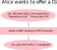
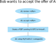
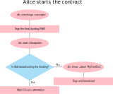
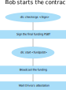
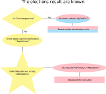

# Documentation
## General Concepts

A DLC can be seen as a smart contract involving two `parties`, a future `event`, a set of outcomes and a `payoff function`.
An `outcome` can be `attested` by an `oracle`. The `oracle` does not need to interact with either party, and its only role is to `attest` the outcome of the event.

The `payoff function` determines the two parties' profit or loss depending on which outcome get `attested`.

The `oracle` roles is to define the `event` and `attest` a single outcome of the event.

Let's call Alice and Bob the two parties of the contract, and Olivia the oracle.


## How to run this project?

The details are explained in the [README](../README.md), in the rest of this documentation, we will only documents the way to use the CLI, but not the details of how dotnet works.

So if we document you to run

```bash
info
```

What we really mean is that you need to run:

```bash
cd NDLC.CLI
```
And in that folder run.

```bash
dotnet run -c Release -- info
```

or, if you don't want to build: 

```bash
dotnet run -c Release --no-build -- info
```

## About the CLI

By default, the CLI assumes you are using Bitcoin mainnet and the location of a data directory where it will store its state.
```bash
info
```
Will tells you more.

In all the commands we are using you can change those by specifying global options before the first command.

```bash
--network testnet info
```

In this example, `info` is the first command, and `--network` is a global option, because it appears before the first command.
Every command might have children, or their own parameters. You can discover those by using `--help`.

You can invoke help at different levels:

Root level:
```bash
--help
```
`oracle` level:
```bash
oracle --help
```
`oracle list` level:
```bash
oracle list --help
```

In the documentation below, you can simulate Olivia, Alice and Bob by using different data directory for each of them.

For example:
```bash
--datadir Olivia oracle list
```

## How to create an oracle


So imagine that Olivia wants to run an oracle that other people might decide to use for their DLC.

```bash
oracle generate "Olivia"
```

This will output her oracle's pubkey. She can always get it back later with.

```bash
oracle show "Olivia"
```

Or list it with

```bash
oracle list
```

The pubkey of your oracle is its identity. Olivia will share it to the world.

## Alice and Bob adding Olivia as an oracle

Alice and Bob knows Olivia, and they can both see that Olivia is sharing her oracle's pubkey.
So each of them use `oracle add <oraclename> <pubkey>`:

```bash
oracle add "Olivia" "ab291..."
```

The oracle name is arbitrary and local to bob and alice. They don't have to share the same name, but they have to share the same pubkey.

## Olivia wants to attest an event


Olivia decides she will attest the winner of the US election. So she creates an `event` that she will share with Alice and Bob.

So each of them use `event generate <eventfullname> <outcome1> <outcome2> <outcome...>`:
```bash
event generate "Olivia/elections" "Republicans" "Democrats" "Others"
```

The event full name is in the format `oraclename/eventname`. On Olivia's installation, the oracle's name she created was `Olivia`, and event name is local and arbitrary `elections`.

The command is giving the event's `nonce`, that she can share with the world along with the outcomes.

She can use `event list` and `event show` to get back the information of the event.

## Alice and Bob see Olivia will attest a new event

Alice and Bob can see the announcement of Olivia, since, they are interested, they will add this event with `event add <eventfullname> <nonce> <outcome1> <outcome2> <outcome...>`

```bash
event add "Olivia/elections" "cd291..." "Republicans" "Democrats" "Others"
```

The event full name is in the format `oraclename/eventname`, event name is arbitrary and local to Alice/Bob.

## Alice wants to create a DLC: How to make an offer



First, Alice need to generate a new DLC with the expected payoff for any outcomes, if betting on republicans:

```bash
dlc offer MyFirstDLC Olivia/elections "Republicans:0.6" "Democrats:-0.4"
```

Her maximum loss is 0.4, so she will need to fund a collateral of 0.4 BTC.
She creates a PSBT (but do not broadcast) with her favorite wallet sending 0.4 BTC to herself and run:

```bash
dlc setup MyFirstDLC "<setuppsbt>"
```

The setup PSBT does not need to be signed. The address which 0.4 BTC are sent to, will be used as the payout address when the contract is settled.

She can send the output message (the offer) to Bob.

She get this message at any time with

```bash
dlc show --offer MyFirstDLC
```

At any time, she can get more help with
```bash
dlc show MyFirstDLC
```

## Bob wants to accept the DLC



First, Bob need to review the offer, to make sure he agrees with it:

```bash
dlc review "<offer>"
```

If he accepts, he runs:

```bash
dlc accept MyFirstDLC "<offer>"
```

His maximum loss is 0.6, so she will need to fund a collateral of 0.6 BTC.
He creates a PSBT (but do not broadcast) with his favorite wallet sending 0.6 BTC to himself and run:

```
dlc setup MyFirstDLC "<setuppsbt>"
```

He then send the output message (the acceptation) to Alice.

He can get the same message at any time with:
```bash
dlc show --accept MyFirstDLC
```

The PSBT does not need to be signed. The address which 0.6 BTC are sent to, will be used as the payout address when the contract is settled.

At any time, he can get more help with
```bash
dlc show MyFirstDLC
```

## Alice starts the contract



Now Alice will check that the accept message from Bob is correctl.

```bash
dlc checksigs <accept>
```

This command returns the funding PSBT that Alice need to sign.
This PSBT is sending the collateral of Alice to a multi sig owned by Alice and Bob for the duration of the contract.

She can get the funding transaction at any time with

```bash
dlc show --funding MyFirstDLC
```

Once she signed it, she can start the DLC.

```bash
dlc start MyFirstDLC <signed funding>
```

She can send the resulting output to Bob, so he can start the DLC on his side.
She can see this output at any time with:
```bash
dlc show --sign MyFirstDLC
```

If Alice does not start the DLC by signing and broadcasting the funding transaction, Alice MUST ABORT the DLC, by spending back her collateral to herself.

She can do this by retrieving the setup PSBT with:

```bash
dlc show --abort MyFirstDLC
```

Sign it and broadcast it.

## Bob starts the contract



## The result came: Olivia attest the election



Now imagine Olivia wants to attest the election, she can use `event attest sign <eventfullname> <outcome>`:

```bash
event attest sign "Olivia/elections" "Republicans"
```

This will give back an attestation on the outcome that she can share with the world.

Note if Olivia tried to cheat by attesting two outcomes, by the way DLC works, Alice and Bob would be able to steal her private key.

## Alice and Bob execute the DLC

In the event where Olivia disappears and never give the outcome, Alice and Bob can get a refund by signing and broadcasting the refund transaction.

```bash
dlc show --refund MyFirstDLC
```

The refund DLC can be broadcasted after a timeout set in the condition of the contract.

If Olivia announced her attestation, then Alice or Bob can execute the DLC contract by running

```bash
dlc execute <Attestation>
```

This will output a fully signed transaction which will send the funds according to the payoff function of the DLC for the attested outcome.

